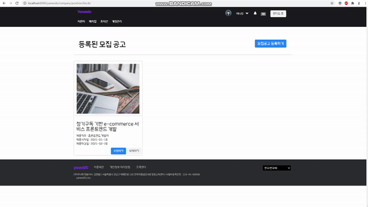
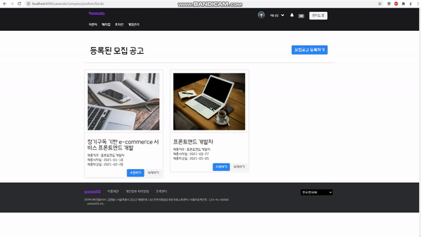
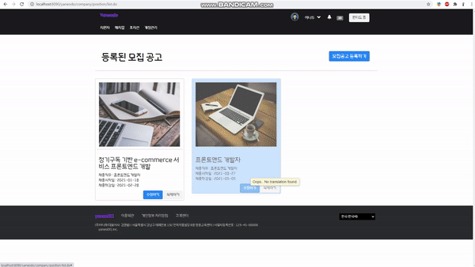
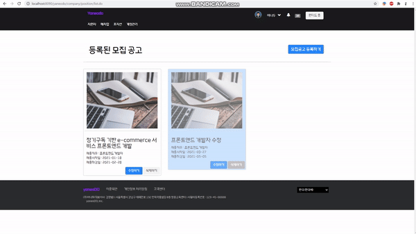

# JSP&Servlet로 만든 개발자 구인구직 사이트

## 개발환경
<table>
    <tr>
        <th>프로젝트명</th>
        <th>Culture Center</th>
        <th>개발 기간</th>
        <th>2021.01.28 ~ 2021.03.02</th>
    </tr>
    <tr>
        <th>프로젝트 개요</th>
        <th>개발자 구인구직 사이트</th>
        <th>개발환경</th>
        <th>Windows 10</th>
    </tr>
    <tr>
        <th>개발언어</th>
        <th>Java(JDK 1.8), HTML, CSS, JavaScript</th>
        <th>형상관리</th>
        <th>Github, Git Bash, Git Desktop</th>
    </tr>
    <tr>
        <th>개발도구</th>
        <th>Eclipse JEE, VSCode, sqlDeveloper</th>
        <th>사용기술</th>
        <th> Apache, Oracle </th>
    </tr>
    <tr>
        <th>개발 인원</th>
        <th colspan="3">6명 : 김영범(팀장), 권주홍, 박영수, 조혜승, 윤지봉, 정경화 </th>
    </tr>
</table>

## 목적
1. 원티드 사이트를 벤치마킹하여 개발자 만을 위한 구인구직 사이트 개발 

## 데이터 구조 

## 담당한 업무
- [기업회원] 지원자 탭 
  - 기업에 지원한 전체 지원자 목록 확인 가능  
  - 채용공고별 지원한 지원자 목록 확인 가능 - 채용공고 메뉴는 동적으로 생성  
  - 지원자의 이름, 직무로 검색 가능, 페이징 처리
  - 이력서를 열람한 지원자 목록 확인 가능 - 지원자 이력서 확인 가능  
  
- [기업회원] 매치업 탭
  - 야너두 모든 회원의 프로필을 확인 가능
  - 직무별 검색, 찜하기, 페이징 기능
  - 이력서 미리보기로 회원의 이력서를 확인 가능 (마스킹 처리된 이력서)
  - 열람권을 사용하여 이력서 상세보기 가능  
  
- [기업회원] 모집공고 탭
  - 모집공고 등록 
  - 모집공고 조회 가능
  - 모집공고 수정 가능
  - 모집공고 삭제 가능

### 

### 모집공고 등록

### 모집공고 조회

### 모집공고 수정

### 모집공고 삭제

