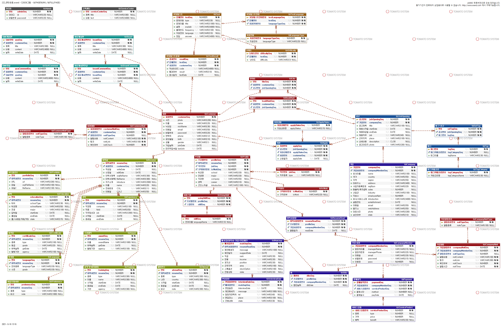
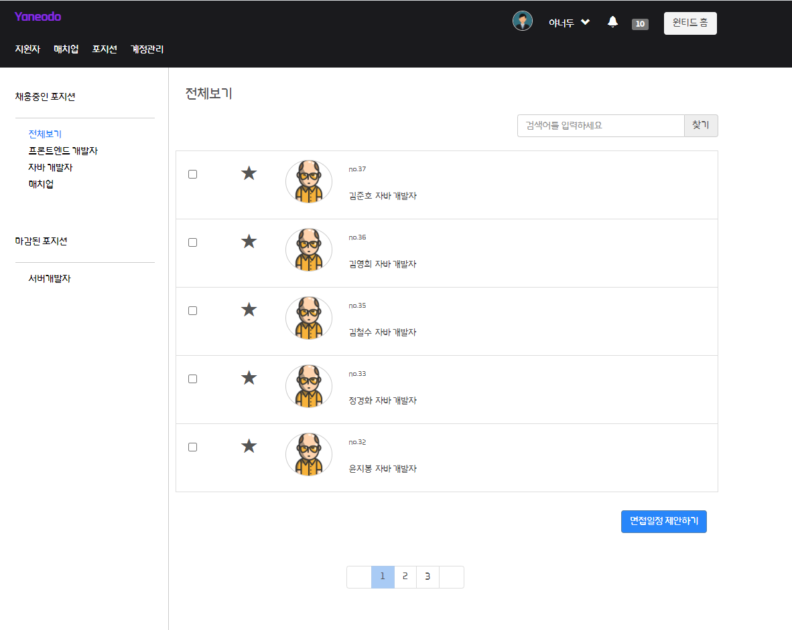
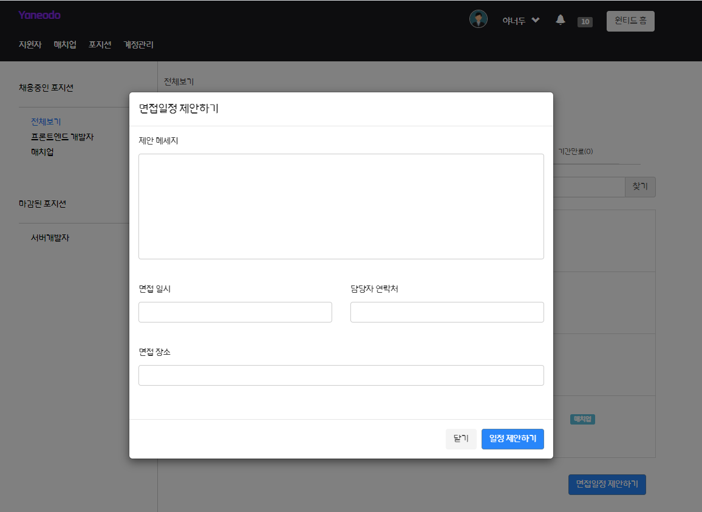
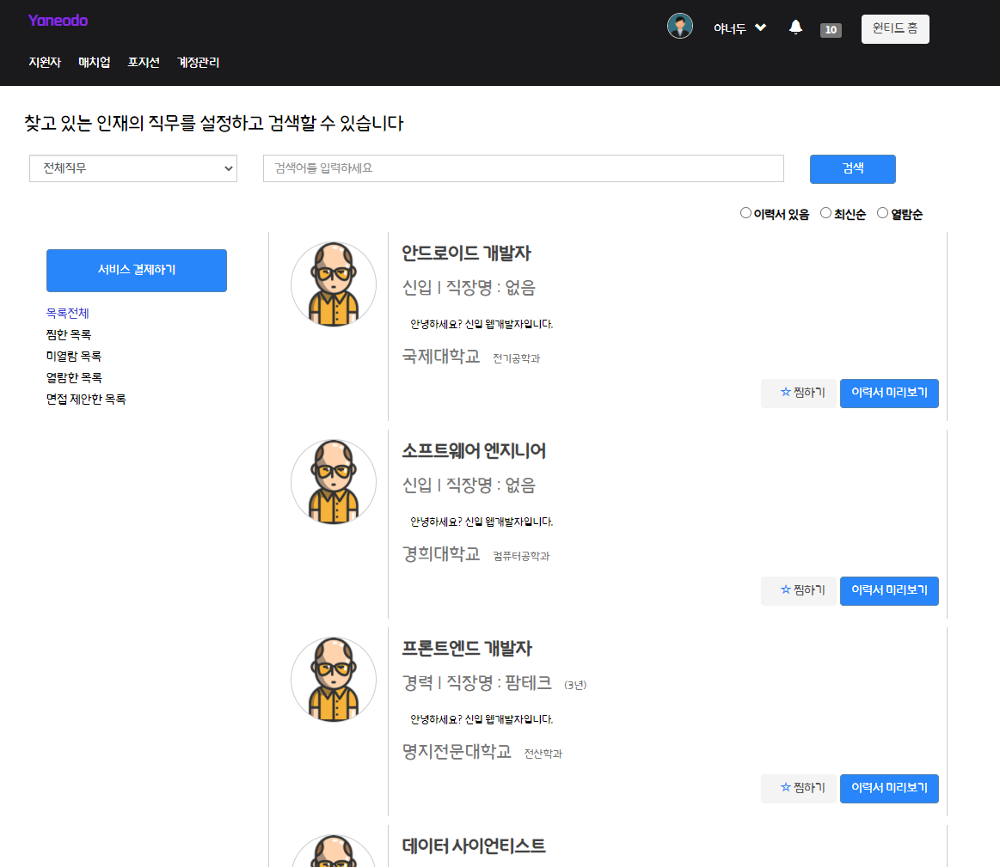
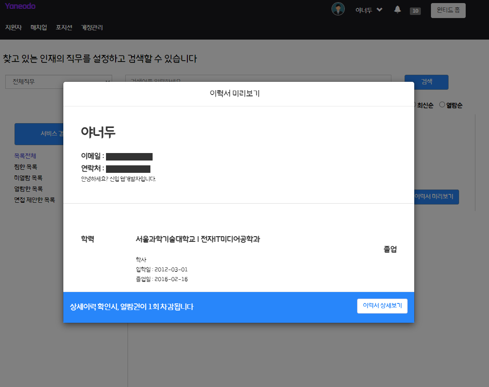
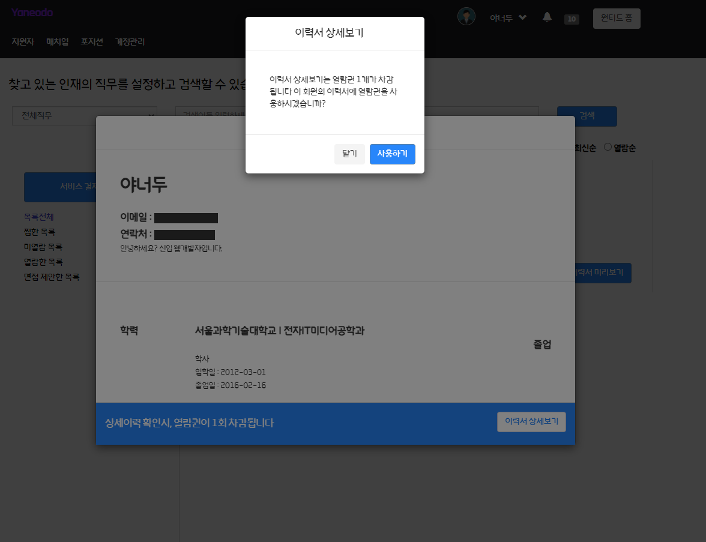
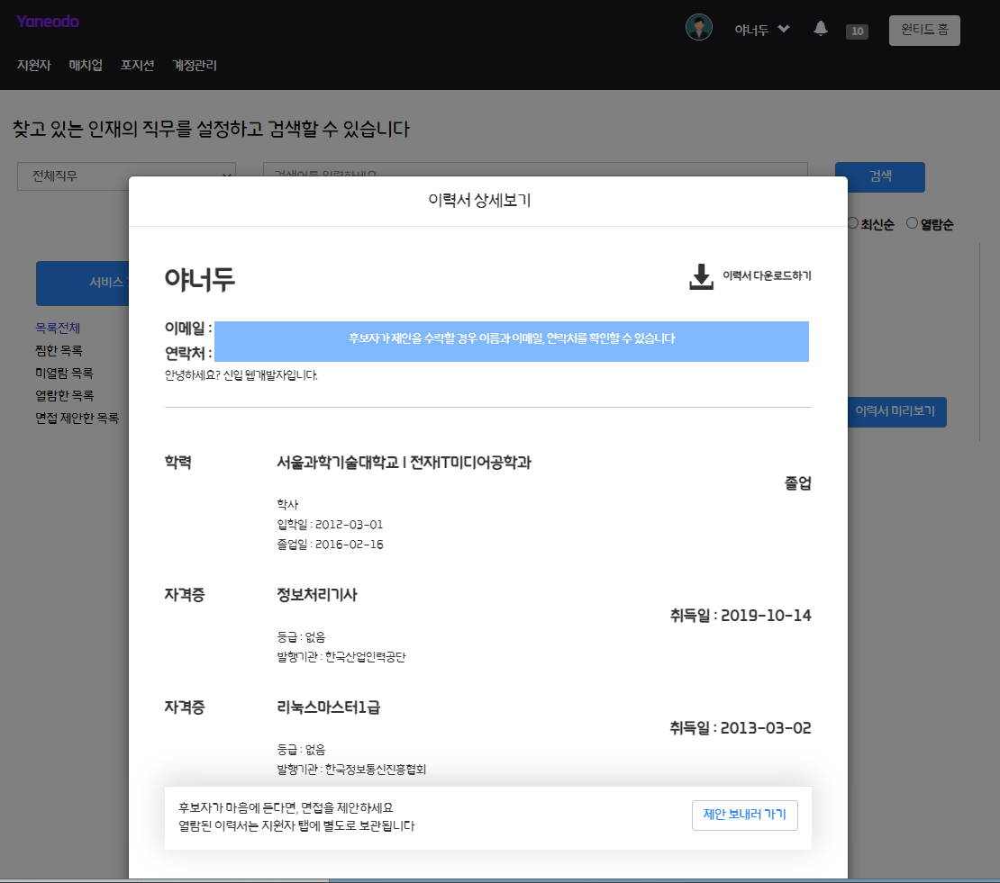
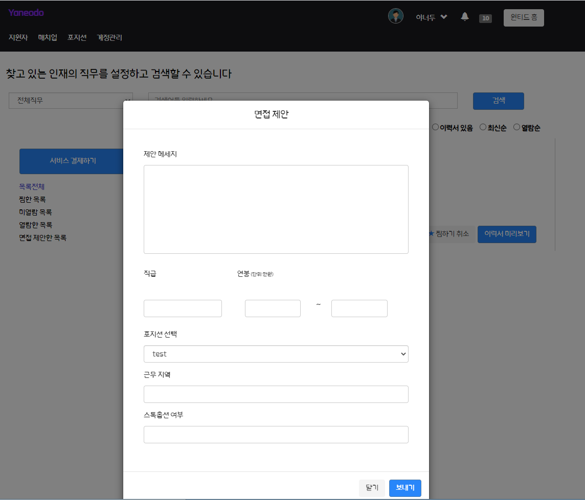
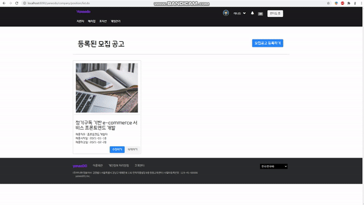

# [JSP&Servlet] 개발자 전용 구인구직 사이트

## 개발환경
<table>
    <tr>
        <th>프로젝트명</th>
        <th>Yaneodo</th>
        <th>개발 기간</th>
        <th>2021.01.28 ~ 2021.03.02</th>
    </tr>
    <tr>
        <th>프로젝트 개요</th>
        <th>개발자 구인구직 사이트</th>
        <th>개발환경</th>
        <th>Windows 10</th>
    </tr>
    <tr>
        <th>개발언어</th>
        <th>Java(JDK 1.8), HTML, CSS, JavaScript</th>
        <th>형상관리</th>
        <th>Github, Git Bash, Git Desktop</th>
    </tr>
    <tr>
        <th>개발도구</th>
        <th>Eclipse JEE, VSCode, sqlDeveloper</th>
        <th>사용기술</th>
        <th> Apache, Oracle, JSP&Servlet </th>
    </tr>
    <tr>
        <th>개발 인원</th>
        <th colspan="3">6명 : 김영범(팀장), 권주홍, 박영수, 조혜승, 윤지봉, 정경화 </th>
    </tr>
</table>

## 목적
1. 원티드 사이트를 벤치마킹하여 개발자 만을 위한 구인구직 사이트 개발 

## 데이터 구조 

## 담당한 업무
- [기업회원] 지원자 탭 
  - 기업에 지원한 전체 지원자 목록 확인 가능
  - 모집공고별 지원한 지원자 목록 확인 가능 - 채용공고 메뉴는 동적으로 생성  
  - 지원자의 이름, 직무로 검색 가능, 페이징 처리
  - 이력서를 열람한 지원자 목록 확인 가능 - 지원자 이력서 확인 가능  
  
- [기업회원] 매치업 탭
  - 야너두 모든 회원의 프로필을 확인 가능
  - 직무별 검색, 찜하기, 페이징 기능
  - 이력서 미리보기로 회원의 이력서를 확인 가능 (마스킹 처리된 이력서)
  - 열람권을 사용하여 이력서 상세보기 후 면접 제안 가능
  
- [기업회원] 모집공고 탭
  - 모집공고 등록 가능
  - 모집공고 조회 가능
  - 모집공고 수정 가능
  - 모집공고 삭제 가능

### 기업에 지원한 지원자 목록 확인 & 면접 제안
---

  
  

### 모집공고별 지원자 목록 확인 & 이력서 보기
---

  
  

### 야너두 모든 회원 프로필 & 이력서 미리보기
---

  
  

### 열람권 사용하여 이력서 상세보기 & 면접 제안하기
---

  
  

  
  

### 모집공고 등록
---

### 모집공고 조회
---

### 모집공고 수정
---

### 모집공고 삭제
---

## 후기
---
JSP&servlet 프로젝트 진행하면서 콘솔프로젝트와는 다르게 구현한 부분을 웹 페이지로 확인할 수 있었습니다. 기능을 하나씩 구현할 때마다 제가 만든 부분을 바로바로 확인할 수 있었고, 그것에 대해 만족감과 성취감을 느꼈습니다. 또 기능을 구현해나가다 보니 점점 욕심이 생겨서 개발을 더 잘하고 싶다는 생각이 들었습니다. 아쉬웠던 점은 프로젝트의 초반 단계인 요구분석서 작성, ERD 작성 단계에서 세세한 부분에 신경 쓰지 못한 점입니다. 그로 인해서 서버 개발 단계에서 ERD 수정할 일이 계속 발생했습니다. 프로젝트의 마지막 단계인 서버 개발 단계에서 작업 속도가 나지 않다 보니 담당한 기능을 완벽하게 끝내지 못했고, 그 부분이 매우 아쉽습니다. 마지막으로 함께 고생한 팀원들에게 감사하다는 말을 전하고 싶습니다
